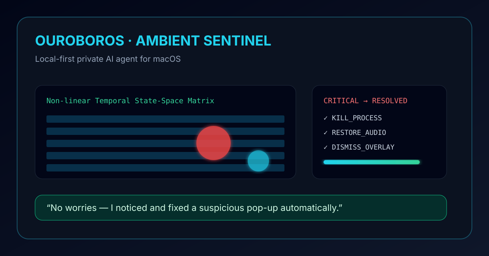
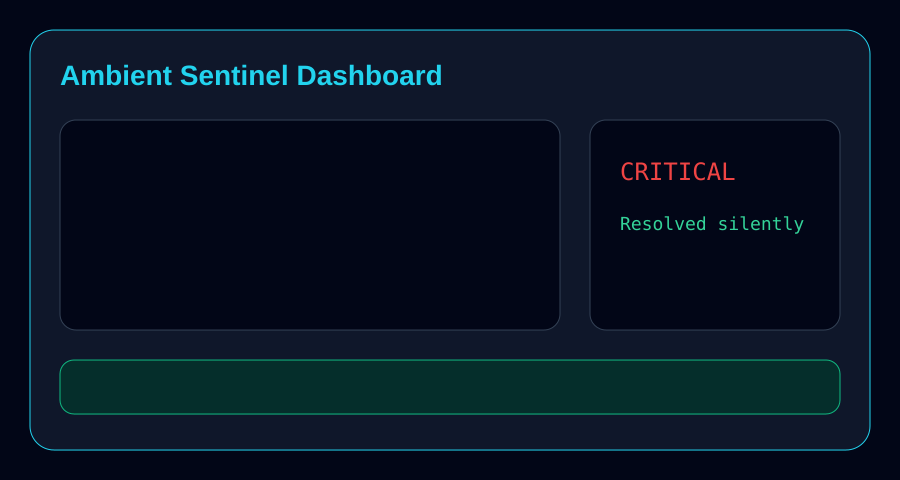
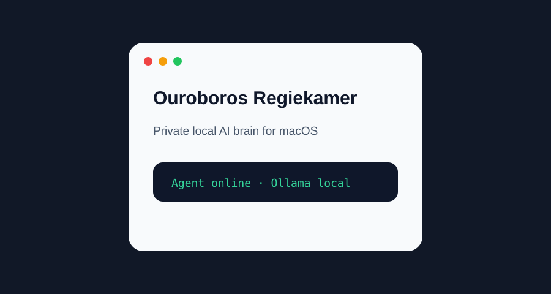

<div align="center">

# 🦅 Ouroboros

### Local-first private AI agent for macOS

[](https://www.python.org/)
[](https://fastapi.tiangolo.com/)
[](https://ollama.com/)
[](https://www.trychroma.com/)
[](https://www.apple.com/macos/)
[](https://github.com/pwintri2/Ouroboros/actions/workflows/ci.yml)
[](LICENSE)
[](#roadmap)

> **Ouroboros is your private AI brain:** an autonomous agent that runs locally, uses Ollama by default, remembers with ChromaDB, and exposes a FastAPI backend plus a native macOS control room.



[Quickstart](#quickstart-in-3-minutes) · [Ambient Sentinel demo](#ambient-sentinel-demo) · [API](#api) · [Launch kit](#launch-kit) · [Contributing](CONTRIBUTING.md)

</div>

---

## Why Ouroboros?

Most AI assistants optimize for cloud platforms. Ouroboros optimizes for **your machine, your data, and your agency**.

- **Private by default** — local Ollama is the default model tier.
- **Agentic** — routes tasks through an OODA loop: Observe → Orient → Decide → Act.
- **Memorable** — stores local context in ChromaDB instead of forgetting every session.
- **Action-capable** — can use mail, files, web research, sandboxed code execution, and a virtual team of personas.
- **Demo-ready** — includes the Ambient Sentinel PoC: a visual scenario where Ouroboros detects a scareware attack, resolves it silently, and reassures the user.

## Screenshots

| Ambient Sentinel dashboard | Native macOS Regiekamer |
|---|---|
|  |  |

> Replace the SVG placeholders in `docs/assets/` with real screenshots or a GIF when recording the launch demo.

## Quickstart in 3 minutes

### Requirements

- macOS 13+
- Python 3.10+
- [Ollama](https://ollama.com/) running locally
- Docker Desktop for sandboxed code execution
- Swift toolchain for the native Regiekamer app

### Install and run

```bash
git clone https://github.com/pwintri2/Ouroboros.git
cd Ouroboros
python -m venv .venv
source .venv/bin/activate
pip install -r controller/requirements.txt
ollama pull llama3.1
./start.sh
```

Backend-only mode:

```bash
source .venv/bin/activate
PYTHONPATH="$PWD" uvicorn controller.main:app --host 127.0.0.1 --port 8000 --reload
```

Health check:

```bash
curl http://127.0.0.1:8000/health
# {"status":"online","agent":"Wintrip"}
```

## Ambient Sentinel demo

The flagship demo simulates a scareware popup targeting a vulnerable user. Ouroboros detects the compound anomaly, terminates the malicious process, restores audio, closes the overlay, and returns a calm personalized message.

```bash
curl -X POST http://127.0.0.1:8000/demo/run \
  -H "Content-Type: application/json" \
  -d '{
    "inject_attack": true,
    "ticks": 5,
    "user_profile": {
      "name": "Oma Els",
      "language": "nl",
      "tone": "reassuring"
    }
  }'
```

Then inspect current state:

```bash
curl http://127.0.0.1:8000/demo/state
```

Or run the smoke test:

```bash
./scripts/smoke_demo.sh
```

Windows demo users can double-click `start_demo.bat` or run `start_demo.ps1` to start the backend and open the dashboard at `http://localhost:8000`.

## Architecture

```text
┌─────────────────────────────────────────────────────────────────┐
│                         Ouroboros                               │
│                                                                 │
│  SwiftUI Regiekamer  ◄──── HTTP/JSON ────►  FastAPI Controller  │
│                                                    │            │
│        ┌───────────────────────────────────────────┼────────┐   │
│        │                                           │        │   │
│   Agentic Router                              Orchestrator  │   │
│   intent + tools                              OODA loop     │   │
│        │                                           │        │   │
│   ┌────┼────────┬────────────┬────────────┐   ┌────┴────┐   │   │
│   │ Ollama     │ ChromaDB    │ IMAP       │   │ Sandbox │   │   │
│   │ local LLM  │ memory/RAG  │ read-only  │   │ Docker  │   │   │
│   └────────────┴─────────────┴────────────┘   └─────────┘   │   │
│                                                    │        │   │
│                         Ambient Sentinel PoC ◄────┘        │   │
└─────────────────────────────────────────────────────────────────┘
```

### Core components

| Path | Purpose |
|---|---|
| `controller/main.py` | FastAPI app and API routes |
| `controller/router.py` | Agentic routing, intent detection, tool dispatch |
| `controller/orchestrator.py` | OODA task execution loop |
| `controller/knowledge_base.py` | ChromaDB-backed memory layer |
| `controller/sandbox.py` | Docker sandbox for generated code |
| `controller/poc_demo.py` | Ambient Sentinel anomaly simulation |
| `dashboard/index.html` | Browser dashboard for the Sentinel demo |
| `regiekamer/` | Native macOS SwiftUI control room |
| `data/` | Input zone for local documents and knowledge |
| `output/` | Generated reports and human-reviewed outputs |

## Privacy and safety model

1. **Local-first default** — Ollama is Tier 3 and keeps prompts on-device by default.
2. **Scrubbing before cloud escalation** — secrets and sensitive data are filtered before any optional cloud tier.
3. **Read-only mail** — IMAP integrations must not delete, move, or mark email.
4. **Sandboxed execution** — generated code runs in Docker containers with restricted resources.
5. **Path isolation** — local file work is constrained to controlled input/output zones.

## API

| Method | Endpoint | Description |
|---|---|---|
| `GET` | `/health` | Backend health check |
| `GET` | `/models` | Available Ollama models |
| `POST` | `/ask` | Ask the agent a question |
| `POST` | `/orchestrate` | Run an autonomous OODA task |
| `POST` | `/learn/url` | Ingest webpage content into memory |
| `POST` | `/team/discuss` | Run a virtual team discussion |
| `POST` | `/model/switch` | Switch the active model |
| `POST` | `/demo/run` | Run the Ambient Sentinel demo, optionally with `user_profile` |
| `GET` | `/demo/state` | Read current Sentinel state |

## Use cases

- Private personal AI assistant for macOS.
- Local document analysis and knowledge recall.
- Sandboxed autonomous coding experiments.
- Privacy-preserving email triage.
- Ambient safety demos for older or less technical users.
- Research playground for local-first autonomous agents.

## Launch kit

Short copy for social posts:

> Ouroboros is a local-first private AI brain for macOS. It runs Ollama locally, remembers with ChromaDB, executes tasks through an OODA loop, and ships with an Ambient Sentinel demo that detects and resolves a scareware attack before the user panics.

Hacker News title:

> Show HN: Ouroboros — a local-first AI brain for macOS

Suggested communities:

- Ollama and local LLM communities
- privacy-first software groups
- autonomous agent builders
- macOS developer communities
- security and elder-safety technology forums

## Roadmap

- [x] Local LLM integration with Ollama
- [x] ChromaDB memory / Hippocampus RAG
- [x] Agentic router with intent detection
- [x] OODA orchestrator prototype with reflection
- [x] Ambient Sentinel PoC demo
- [x] Personalized `user_profile` support for `/demo/run`
- [ ] Production-ready operation loop without manual approval
- [ ] Clean Docker sandbox setup on macOS with TCC guidance
- [ ] Real launch GIF/video and screenshots
- [ ] More automated smoke/integration tests

## Contributing and security

- Contributions: see [CONTRIBUTING.md](CONTRIBUTING.md)
- Security policy: see [SECURITY.md](SECURITY.md)
- Issues: [github.com/pwintri2/Ouroboros/issues](https://github.com/pwintri2/Ouroboros/issues)

## License

See [LICENSE](LICENSE).

---

<div align="center">

Built with passion for private, local-first AI autonomy.

**Ouroboros AI** — AI that works for you.

</div>
